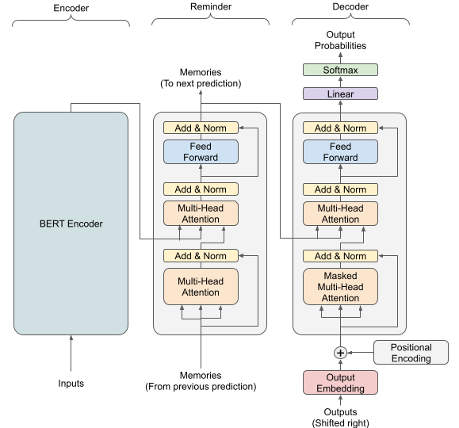
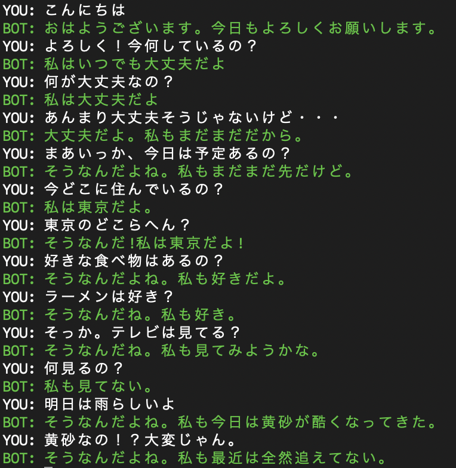

# Chatbot with Transfomer
Transformerを利用した、チャットボットです。
Reminderという新たなレイヤーを導入し、前の会話の記憶を引き継ぐアーキテクチャとなっています。

## モデルアーキテクチャ
モデルはEncoder, Reminder, Decoderの3層構造となっています。
Reminderは前の会話で出力されたメモリーを読み込み、次の会話に入力するために出力します。
EncoderにはBERT, ReminderとDecoderにはTransformerを利用しています。



## 実行例
本コードによって得られたモデルの実行例です。



## 実行方法
### 会話データセットの作成
会話データセットはTwitterから作成します。
事前にTwitterの開発者アカウントを取得し、APIキーやアクセストークンを発行します。
発行したAPIキーを用いて、以下のコマンドを実行すると、`dataset/tweet_data`配下にTSVファイルが出力されます。

```bash
$ python tweet_collector.py \
    --api_key ************************* \
    --api_secret_key ************************************************** \
    --access_token *********-**************************************** \
    --access_token_secret ********************************************* \
    --query 私 \
    --len_conversations 7 \
    --max_token_length 64 \
    --output_dir dataset/tweet_data
```

### 学習
作成した会話データセットを用いて学習します。
学習が終わると、`logs/saved_model`にsaved modelを出力します。

```bash
$ python train.py \
  --dataset_dir dataset/tweet_data \
  --log_dir logs \
  --batch_size 64 \
  --epochs 20 \
  --len_conversations 7 \
  --max_token_length 64
```

### 会話の実行
出力したsaved modelを読み込み、Chatbotと会話を行います。

```bash
$ python chat.py --model_path logs/saved_model
```

